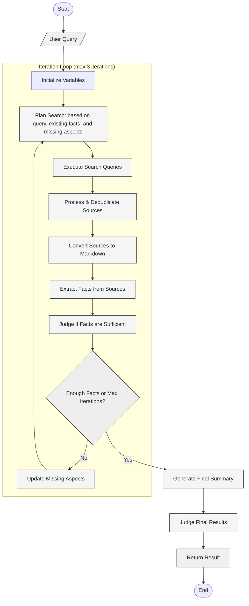

# Deep Research Agent

This is an example agent which performs deep research using [Hatchet](https://hatchet.run/) and [OpenAI](https://openai.com/). While the agent itself is very simple, it is based on best practices that we have observed at Hatchet while executing billions of tasks and agent executions per month.

## Demo

**Video demo:**

https://github.com/user-attachments/assets/d99f8ae2-8ce5-4ce3-9792-d10c1038e413

[**Example report**](./results/20250519_Renewables.md)

## FAQs

**What's the purpose of this repository?**

This is a starting point for building an agent in your own product -- it is not meant as a replacement for Deep Research.

**What is Hatchet?**

Hatchet is an orchestration engine which turns functions into [durable tasks](https://docs.hatchet.run/home/durable-execution) that execute **in parallel** on many machines at once, which helps turn your agents from great demos into fast, reliable production code.

**Does this use a framework?**

We believe **the best framework is no framework**. See [further reading](#further-reading) below for more information.

## Getting Started

> [!CAUTION]
> Running this example is _free on Hatchet (below 1000 tasks/day)_ but will _cost money on OpenAI_. As this is an unconstrained agent, please make sure you are testing this against a low usage limit.

1. Clone the repo:

```
git clone https://github.com/hatchet-dev/hatchet-typescript-deep-research.git
```

2. Generate a Hatchet API token on [Hatchet Cloud](https://cloud.onhatchet.run/) (or [run Hatchet with docker-compose](https://docs.hatchet.run/self-hosting/hatchet-lite)), along with an OpenAI API key. Paste the following into a `.env` file in the root of this directory:

```bash
OPENAI_API_KEY=<your_api_key_here>
HATCHET_CLIENT_TOKEN=<your_hatchet_token>
```

3. Install dependencies:

```bash
pnpm install
```

4. Run the development server:

```bash
pnpm dev
```

5. Trigger your first deep research execution, which will ask you for a prompt (or select from the list):

```bash
pnpm cli
```

## Extending this project

This project is designed as a starting point to build your own agent. The primary entrypoint for the agent can be found in [`src/agents/deep-research/deep-research.agent.ts`](./src/agents/deep-research/deep-research.agent.ts). Tasks (also known as tools) for the agent can be found in the [tasks folder](./src/agents/deep-research/tasks).

The agent implements the following control loop:



## Further reading

To learn more about Hatchet, visit:

- [Hatchet Documentation](https://docs.hatchet.run)
- [Hatchet GitHub Repository](https://github.com/hatchet-dev/hatchet)

To learn more about what informs our agent design and architecture, see:

- [12-factor agents](https://github.com/humanlayer/12-factor-agents)
